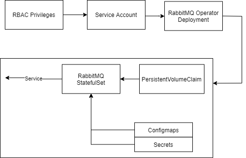

# RabbitMQ Cluster Operator

RabbitMQ operator installation instructions can be found [here](https://www.rabbitmq.com/kubernetes/operator/install-operator.html#installation).

The kustomization install base is available in the rabbitmq cluster-operator github under [config/installation](https://github.com/rabbitmq/cluster-operator/tree/main/config/installation).

## Overview

## References:
- https://github.com/rabbitmq/cluster-operator/
- https://www.rabbitmq.com/kubernetes/operator/operator-overview.html
- https://github.com/bitnami/charts/tree/master/bitnami/rabbitmq-cluster-operator

